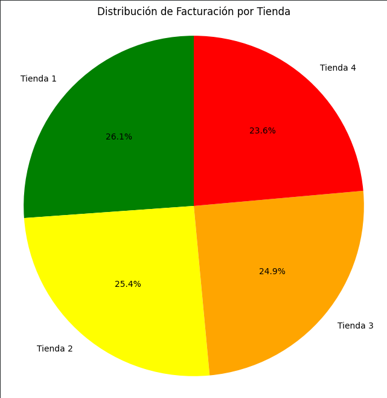
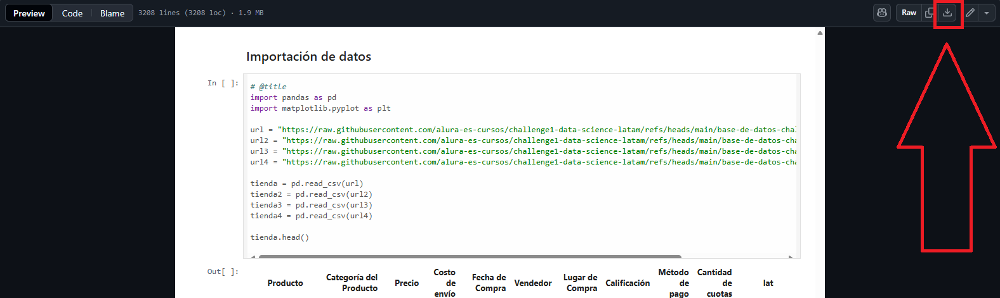

# 🛍️ Análisis Comparativo de Tiendas - Challenge Alura Store

Este proyecto presenta un análisis exploratorio y comparativo de datos de ventas, calificaciones y logística de cuatro tiendas con el objetivo de tomar una decisión informada sobre cuál de ellas debería ser vendida.

---

## 🎯 Propósito del Análisis

El objetivo principal es evaluar el desempeño de cada tienda a partir de métricas clave como:

- Facturación total
- Ventas por categoría
- Calificación promedio de los clientes
- Productos más y menos vendidos
- Costo promedio de envío

Con base en estos indicadores, se busca identificar la tienda con menor rendimiento general para recomendar su venta.

---

## 📁 Estructura del Proyecto

- ├── Challenge_Alura_Store.ipynb 
- ├── README.md 
- └── /imagenes

---

## 📊 Ejemplos de Gráficos e Insights

A continuación se muestran algunos ejemplos de visualizaciones generadas durante el análisis:

### 📈 Facturación total por tienda

 

> La Tienda 4 presenta la menor facturación total, lo que la posiciona como candidata para ser vendida.

---

### 📉 Calificaciones promedio

> La Tienda 1 tiene la calificación más baja (3.97), mientras que la Tienda 3 lidera con 4.05.

---

### 🧸 Productos más y menos vendidos

 

> Se identificaron patrones comunes entre los productos más vendidos (ej. Microondas, Bloques de construcción) y productos con baja rotación (ej. Celular ABXY, Asistente virtual).

---

## ⚙️ Instrucciones para Ejecutar el Notebook

1. Descarga el archivo "Challenge_Alura_Store.ipynb"
    
3. Abrir en Google Colab
4. Ejecuta todas las celdas del notebook para reproducir el análisis completo.
    

---

## 🧠 Conclusión

El análisis sugiere que la Tienda 4 es la opción más viable para ser vendida, ya que presenta el rendimiento más bajo en facturación, volumen de ventas y calificación promedio, sin ventajas competitivas claras frente a las demás.

